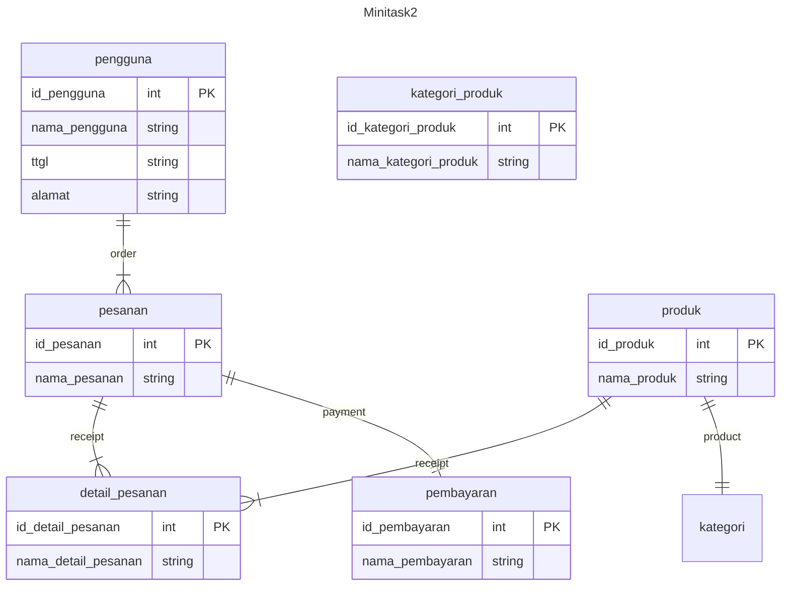
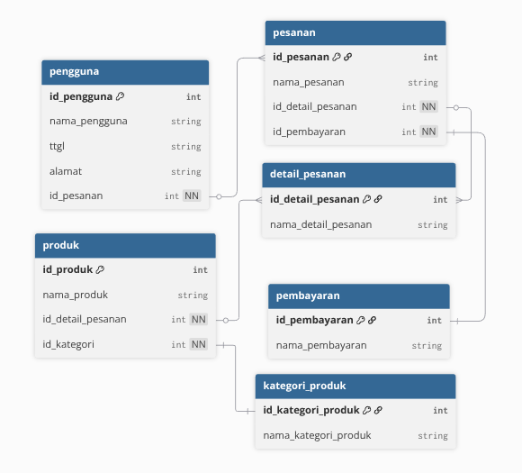

<!-- 
Pengguna
Produk
Kategori Produk
Pesanan
Detail Pesanan
Pembayaran 

pengguna dapat membuat banyak pesanan (1-N)
produk dapat termasuk dalam banyak detail pesanan (1-N)
pesanan dapat memiliki banyak detail pesanan (1-N)
pesanan memiliki satu pembayaran (1-N)
produk memiliki satu kategori produk (1-N)
-->

